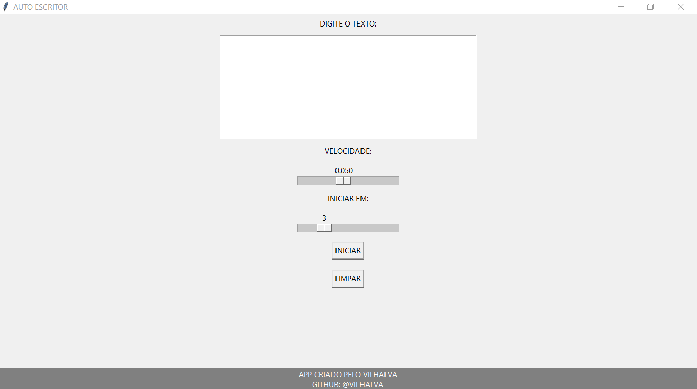

# AUTO ESCRITOR
🎈AUTOMATIZE O PROCESSO DE DIGITAÇÃO.

  

## DESCRIÇÃO:
O aplicativo "AUTO ESCRITOR" é uma ferramenta desenvolvida em Python com uma interface gráfica Tkinter, projetada para automatizar a digitação de texto em um ambiente de desktop. 

## FUNCIONALIDADES:
1. **Campo de Texto para Digitação:**
   - O aplicativo apresenta um campo de texto expansível, onde os usuários podem inserir o texto que desejam automatizar.

2. **Barra de Velocidade (segundos):**
   - Uma barra deslizante horizontal permite aos usuários ajustar a velocidade de digitação desejada, variando de 0.010 a 0.100 segundos.

3. **Barra de Atraso Inicial (segundos):**
   - Outra barra deslizante horizontal possibilita que os usuários escolham um atraso inicial antes de iniciar a automação. O intervalo é de 1 a 10 segundos.

4. **Botão Iniciar:**
   - Ao clicar no botão "Iniciar", o aplicativo minimiza a janela e inicia a automação de digitação com base nas configurações fornecidas.

5. **Botão Limpar:**
   - O botão "Limpar" permite aos usuários apagar o conteúdo do campo de texto, facilitando a entrada de novo texto.

## EXECUTANDO O PROJETO:
1. Execute o arquivo Python.
2. Isso abrirá a interface do aplicativo de digitação automática.
3. Digite o texto que deseja que seja digitado automaticamente na área de texto fornecida.
4. Use o controle deslizante "Velocidade" para ajustar a velocidade de digitação. Quanto menor o valor, mais rápida será a digitação.
5. Use o controle deslizante "Iniciar em" para definir o tempo de espera antes de iniciar a digitação automática.
6. Clique no botão "Iniciar" para iniciar o processo de digitação automática com as configurações especificadas.
7. Durante o tempo de espera definido, posicione o cursor em qualquer campo de texto onde deseja que o texto seja digitado automaticamente.
8. O texto será digitado automaticamente com a velocidade e o atraso especificados.
9. Para limpar o campo de texto e os controles deslizantes, clique no botão "Limpar".
10. Para sair do aplicativo, feche a janela.

## SOBRE O EXECUTAVEL:
- Este arquivo executável está disponível apenas para `Windows X64`. Para executá-lo, basta dar dois cliques. O executável é bastante útil caso o Python não esteja instalado. Trata-se da mesma aplicação do arquivo `CODIGO.py`. Se desejar, você pode recompilá-lo novamente; é para isso que forneci o arquivo `imagem.ico`.

## NÃO SABE?
- Entendemos que para manipular arquivos em muitas linguagens e tecnologias, é necessário possuir conhecimento nessas áreas. Para auxiliar nesse aprendizado, oferecemos cursos gratuitos disponíveis:
* [CURSO DE PYTHON](https://github.com/VILHALVA/CURSO-DE-PYTHON)
* [CURSO DE TKINTER](https://github.com/VILHALVA/CURSO-DE-TKINTER)
* [CURSO DE EXE](https://github.com/VILHALVA/CURSO-DE-EXE)
* [CONFIRA MAIS CURSOS](https://github.com/VILHALVA?tab=repositories&q=+topic:CURSO)

## CREDITOS:
- [PROJETO CRIADO PELO VILHALVA](https://github.com/VILHALVA)

